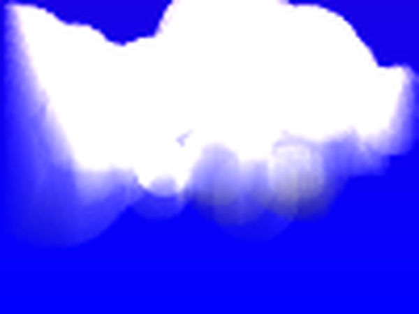

# 2024.3.4 雲を白く描く

空の雲が白く見えるのは、白い色がついているわけではなく、太陽光を散乱したものが目に届くためです。雲は空の水や氷の粒で構成されていて、そうした粒子は光の波長に比べ十分に大きいため、すべての光を均等に散乱します。そのため光の色は白く見えます。湯気やスモークが (太陽光下では) 白く見えるのも、同じ仕組みです。水や氷のような大きな粒子が光を散乱する仕組みをミー散乱と言います。

雲が地上にあると霧になります。霧が濃いと向こう側はほとんど見えなくなりますが、これは向こうから来る光が散乱されてしまうためです。手前から光を当てると霧がまぶしく光って見えますが、これは当てた光が散乱して手前に帰ってくるためです。霧や雲がどう見えるかは、向こうがわから散乱されながら透過してくる光と、光源からの光を散乱したものとを合算して考えます。

## 実装

この考え方を非常に単純化して実現してみました。

たいそう微妙ですが、雲は白く見え、フチはぼんやりして背景を透過しており、また下側は暗く (黒く) なるという点は、計算通りになっています。なおコードで生成した画像はサイズが100x75ピクセルで、ここにある画像はそれを拡大しています。

ここでは、以下のようなアプローチで計算をしています。

- 3次元のグリッドで区切った空間を定義します (volumetric space)
- 空間上に、ランダムな球形の雲を想定して、雲(粒子)の存在するグリッドを計算します
- 太陽光はY軸無限遠方向から、平行光線として照らします
- カメラをZ軸に向けて置きます
- 雲の存在するグリッドは全方向に(＝カメラ方向に)白い光を散乱し、同時に下(Y軸マイナス方向)への光を減衰します
- 雲の存在するグリッドは、背景(青空)の光を減衰させます
- カメラの映像を静止画として計算します

散乱や減衰の割合は適当に、結果の見た目がそれっぽくなるように設定しています。

[ソースコード](https://github.com/yattom/dtd_ex001_gen_image_py/blob/main/gen.py)
- 

## 参考資料

- https://ja.wikipedia.org/wiki/%E3%83%9F%E3%83%BC%E6%95%A3%E4%B9%B1
- https://www.ccs-inc.co.jp/guide/column/light_color/vol21.html

